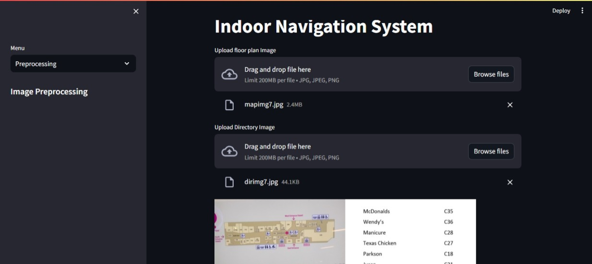
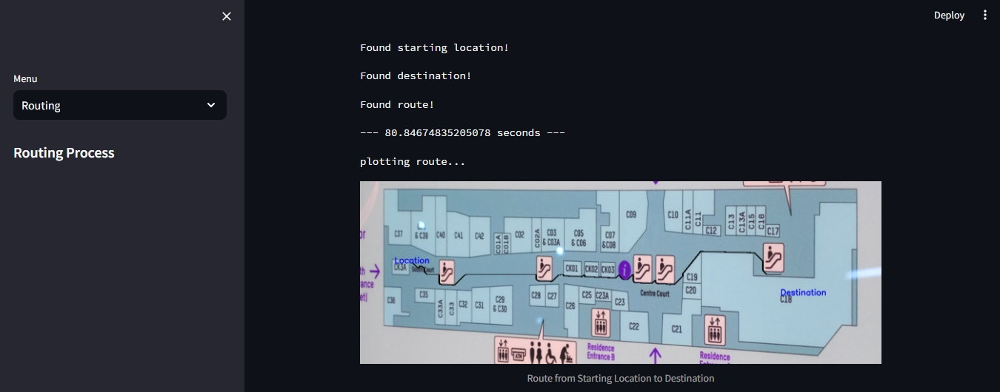
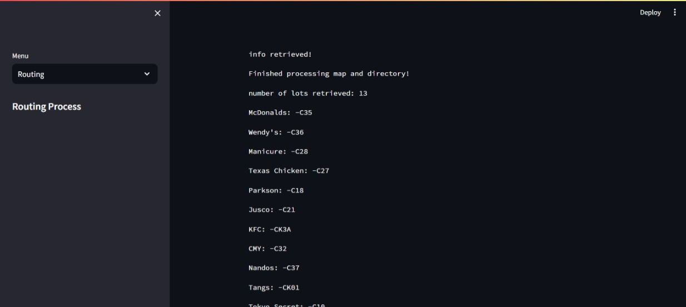
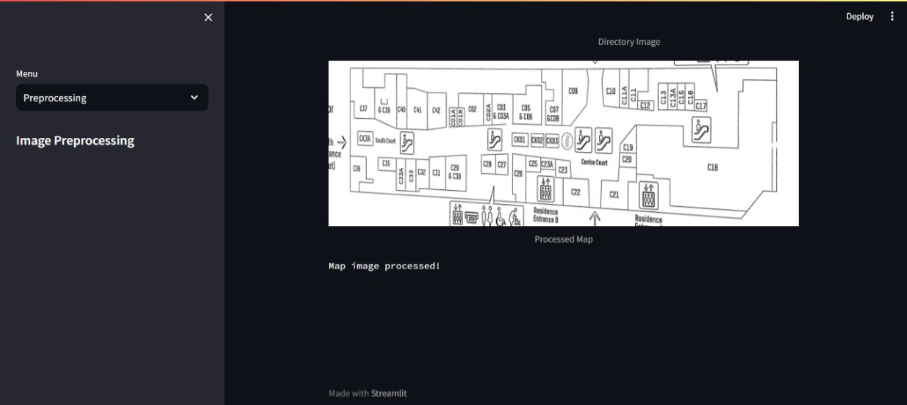

# INDOOR NAVIGATION SYSTEM FOR LARGE BUILDINGS USING A STAR SHORTEST PATH ALGORITHM
### Final year project for Bachelor's in Computer Science

An indoor navigation system approach without prior knowledge or device requirements was proposed and implemented. Users of the system need only a taken photo of a directory map and directory lot listing for navigation to take place. The system is achieved through implementation of perspective correction, text recognition, lot segmentation with labeling, the A* shortest path algorithm was used to implement the routing of the navigation system. The Programming tool used to develop this system was the python programming language, the opencv library for image processing, the Google vision API for Optical Character Recognition and also the streamlit library to implement the User Interface. The major source of data for this project is through the floor plan of the building.

## Usage

To use this code, follow these steps:

- Clone this repo using any method (https, ssh, gh cli)

- Install the required packages by running the following command:
```shell
   pip install -r requirements.txt
```
- [Generate your Google vision API keys here]
(https://cloud.google.com/docs/authenticationprovide-credentials-adc#local-dev)


- Run the code using the following command:
```shell
   streamlit run indoor_nav.py
```

- The Streamlit web application will open in your browser.

## Images
<!--Images-->










